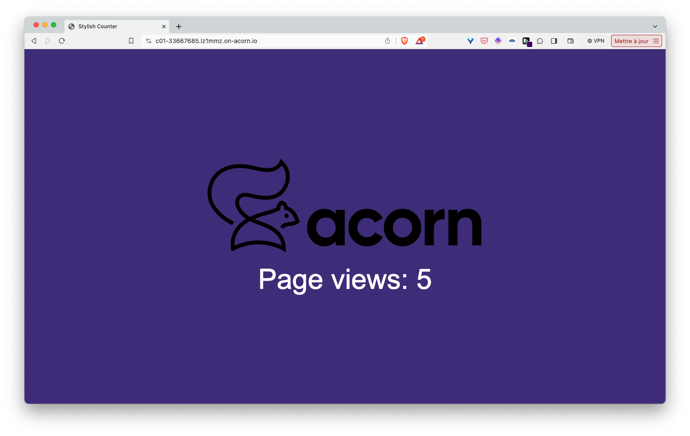

## What is Cassandra ?

Apache Cassandra is a highly scalable, distributed NoSQL database designed for handling large volumes of data across multiple commodity servers without a single point of failure. It provides high availability, fault tolerance, and supports linear scalability for both write and read operations.

## Cassandra as an Acorn Service

The Acornfile used to create a Cassandra based Acorn Service is available in the GitHub repository at [https://github.com/acorn-io/cassandra](https://github.com/acorn-io/cassandra). This service triggers the creation of Cassandra database running in a single container which can easily be used by an application during development.

This Cassandra instance:
- uses a default (auto generated) password for the admin user
- defines a default keyspace

The Acorn image of this service is hosted in GitHub container registry at [ghcr.io/acorn-io/cassandra](ghcr.io/acorn-io/cassandra)

## Usage

The [examples folder](https://github.com/acorn-io/cassandra/tree/main/examples) contains a sample application using this Service. This app consists in a Python backend based on the FastAPI library, it displays a web page indicating the number of times the application was called, a counter is saved in the underlying Cassandra database and incremented with each request. The screenshot below shows the UI of the example application. 



To use the Cassandra Service, we first define a *service* property in the Acornfile of the application:

```
services: db: {
	if args.dev {
		build: {
			context:   "../"
			acornfile: "../Acornfile"
		}
	} else {
		image: "ghcr.io/acorn-io/cassandra:v#.#.#-#"
	}
}
```

Note: the service is built first if in development mode

Next we define the application container. This one can connect to the Cassandra service via environment variables which values are set based on the service's properties.

```
containers: {
	app: {
		build: {
			context: "."
			target:  "dev"
		}
		consumes: ["db"]
		ports: publish: "8000/http"
		env: {
			DB_HOST: "@{service.db.address}"
			DB_PORT: "@{service.db.port.9042}"
			DB_KEYSPACE: "@{service.db.data.keyspace}"
			DB_USER: "@{service.db.secrets.admin.username}"
			DB_PASS: "@{service.db.secrets.admin.password}"
		}
	}
}
```

This container is built using the Dockerfile in the examples folder. Once built, the container consumes the Cassandra service using the address and credentials provided through the dedicated variables.

This example can be run with the following command (to be run from the *examples* folder)

```
acorn run -n app -i
```

After a few tens of seconds an http endpoint will be returned. Using this endpoint we can access the application and see the counter incremented on each reload of the page.

## About Acorn Sandbox

Instead of managing your own Acorn installation, you can deploy this application in the Acorn Sandbox, the free SaaS offering provided by Acorn. Access to the sandbox requires only a GitHub account, which is used for authentication.

[](https://acorn.io/run/ghcr.io/acorn-io/cassandra/examples:v%23.%23.%23-%23)

An application running in the Sandbox will automatically shut down after 2 hours, but you can use the Acorn Pro plan to remove the time limit and gain additional functionalities.